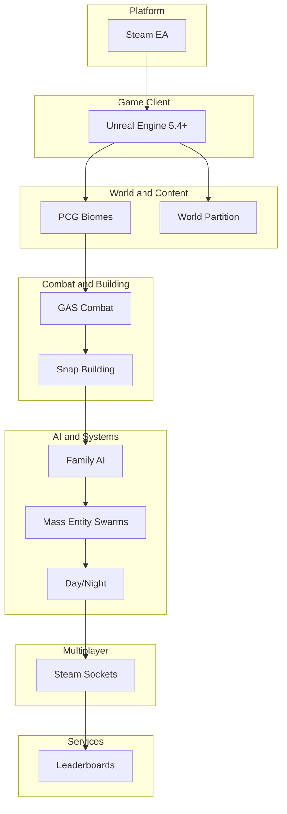

# HomeWorld – High-Level Stack Plan

This document aligns the development group on engine, plugins, services, and content pipeline. Scope is driven by the prototype vision and roadmap: explore → fight → build (Act 1), then bonds, co-op, day/night defense, and leaderboards (Act 2–3).

---

## Stack Overview

---

## Layer 1 – Engine and Platform

- **Engine:** Unreal Engine 5.4+ (project currently 5.7). Open World template, World Partition.
- **Platform:** PC, Steam Early Access. No console in MVP.
- **Rationale:** Single codebase; Lumen/Nanite for whimsical look; World Partition for large proc-gen realms.

---

## Layer 2 – World and Procedural Content

- **Core:** UE PCG (Procedural Content Generation) – already enabled in project.
- **Recommended:** PCG for biomes (forest first, then sand/crystal); portals or sublevels for “realm-hop.” Optional: PCGEx or Biome Core (free) for more complex graphs.
- **Phase:** Week 1 – forest biome; Weeks 3–4 – second biome. Load on-demand via World Partition/streaming.

---

## Layer 3 – Combat and Abilities

- **Core:** Gameplay Ability System (GAS) – already enabled. Base ability and attribute classes are in C++; specific abilities and data (e.g. 3 survivor skills) in Blueprint.
- **Recommended:** Blueprint-first (Ninja GAS Blueprint or similar) for 3 survivor skills in Act 1; extend for needs/buffs in Act 2 (family sim). Optional paid: Advanced ARPG Template (~$50) for PoE-style trees/combos.
- **Phase:** Week 1 – 3 skills; Week 2 – GAS for relationship/needs if desired.

---

## Layer 4 – Building and Home

- **Recommended:** Blueprint-based snap/placement; optional Behavior or State Trees for “home” logic. No mandatory plugin; Week 1 = basic placement or placeholder.
- **Phase:** Week 1 – minimal build/claim; Week 2 – home as first-class space for duo and night defense.

---

## Layer 5 – AI and Simulation

- **Family/NPCs:** Behavior Trees or State Trees (UE built-in); needs/morale can use GAS attributes.
- **Swarms:** Mass Entity – already enabled; Mass Gameplay / Mass AI (optional) for night swarms scaling with family size.
- **Phase:** Week 2 – family AI; Weeks 3–4 – Mass Entity swarms.

---

## Layer 6 – Day/Night and Systems

- **Recommended:** Day/Night sequencer (plugin or custom); PCG or level logic for night spawns. Tied to “family defends at night” pillar.
- **Phase:** Weeks 3–4 (Alpha).

---

## Layer 7 – Multiplayer and Co-op

- **Recommended:** Steam Sockets (replaces SteamCore/Steam Sessions) for 2–8p; replication for roles, buffs, and state. Optional: AWS GameLift (free tier) for dedicated servers if needed later.
- **Phase:** Week 2 – 2p; Weeks 3–4 – up to 8p clans.

---

## Layer 8 – Leaderboards and Services

- **Recommended:** Steam API (free) for leaderboards; or SteamLead (~$20) for turnkey. Score formula: (family size × happiness) + clears.
- **Phase:** Weeks 3–4; polish post-alpha.

---

## Content Pipeline and Assets

- **Recommended:** FAB for character(s) (e.g. survival char); Quixel for biomes/vegetation; UE Marketplace / Quixel for stylized fantasy where needed. Pipeline: import → Blueprint/PCG; no custom engine.
- **Phase:** Week 1 – FAB + Quixel for forest; expand in later phases.

---

## Phase–Tech Map

| Phase      | World/PCG | Combat/GAS | Building | AI   | Day/Night | Multiplayer | Leaderboards | Assets |
| ---------- | --------- | ---------- | -------- | ---- | --------- | ----------- | ------------ | ------ |
| Pre-prod   | —         | —          | —        | —    | —         | —           | —            | —      |
| Week 1     | In use    | In use     | In use   | —    | —         | —           | —            | In use |
| Week 2     | In use    | In use     | In use   | In use | —       | In use      | —            | In use |
| Weeks 3–4  | In use    | In use     | In use   | In use | In use   | In use      | In use       | In use |
| Post-alpha | In use    | In use     | In use   | In use | In use   | In use      | In use       | In use |

---

## Budget and “Free First”

- **Free:** UE5, PCG, GAS, Mass Entity, Steam API, FAB/Quixel free assets, Open World template.
- **Optional paid:** Advanced ARPG Template (~$50), SteamLead (~$20), GameLift if needed. Total optional ~$70–150; time is the main cost.

---

## References

- [PROTOTYPE_VISION.md](PROTOTYPE_VISION.md) – theme, Act 1 focus, Week 1 playtest goal
- [../ROADMAP.md](../ROADMAP.md) – phases, pillars, campaign
- [WEEK1_TASKS.md](WEEK1_TASKS.md) – Week 1 task breakdown
- [SETUP.md](SETUP.md) – developer setup checklist
